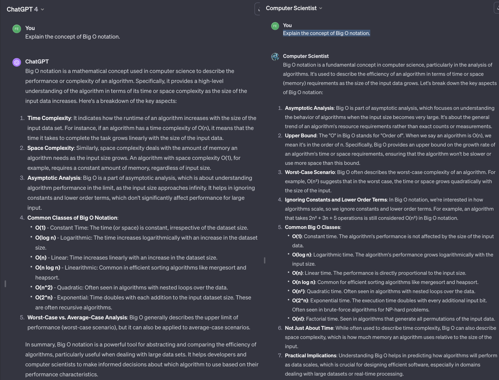

  
# Crafting a Computer Scientist GPT: A Journey Through OpenAI's Customizable LLMs; GPTs

OpenAI's GPTs could revolutionize the way we interact with ChatGPT by allowing the creation of specialized 'GPTs', customized LLMs without coding. This guide aims to introduce and demonstrate the process of crafting a "Computer Scientist GPT" designed to assist with complex Computer Science concepts.

Zero shot 'Explain the concept of Big O notation' with [ChatGPT](https://chat.openai.com/share/897b7236-d881-4953-9156-6c5c8f2bf972) and [Computer Scientist GPT](https://chat.openai.com/share/a32fac48-0bfa-492f-89cd-21ad18855695)

As you can see in the image above, the Computer Scientist GPT does a much better job at explaining the Computer Science concept of "Big O Notation" than the generic ChatGPT. 

## Understanding the limitations of OpenAI's 'GPTs'

### Understanding Limitations and Strengths of GPT-4:

- **Contextual Depth and Memory**: ChatGPT can struggle with maintaining long-term context and deep understanding of complex subjects.

- **Generative Limitations**: GPT-4, like other models in its family, excels in generating text but has limitations synthesizing new concepts or ideas. It lacks the contextual understanding of the real world and may struggle to create new concepts or ideas.

- **Handling Ambiguity**: GPT-4 may struggle with ambiguous queries or instructions. It is recommended to provide clear, specific instructions to avoid confusion.

- **Data Recency**: GPT-4's training only includes data up to 2023, making it less reliable for recent developments or cutting-edge topics. A GPT can be instructed to use a web search tool to find updated information, but it does not work reliably, and it is recommended include any recent information in the instructions.

- **Detailed Technical Knowledge**: While proficient in general topics, GPT-4 may lack in-depth technical expertise in highly specialized or niche areas.

- **Error Propagation**: GPT-4 can confidently present incorrect information, leading to the propagation of errors if not properly checked.

- **You Get What You Ask For**: GPT-4 is a powerful tool, but it is only as good as the instructions it is given. It is recommended to provide long comprehensive, clear, specific instructions to avoid confusion. Do not expect GPT-4 to zero a complex task without detailed instructions.

- **Be Nice**: GPT-4 accurately reflects the biases and prejudices of the data it is trained on. When people treat others poorly, people react negatively. The same is true for GPT-4. It is recommended to be polite and respectful when interacting with GPT-4 to get productive responses.

## Things to keep in mind about 'Computer Scientist GPT'

For our 'Computer Scientist GPT', it is important to note that while it can *simulate* understanding of computer science concepts, its responses are based on patterns in data rather than true comprehension. 

#TODO - EVERYTHING BELOW THIS LINE IS A WORK IN PROGRESS AND NEEDS A LOT OF LOVE

## Creating a 'Computer Scientist GPT'

### 1. Defining the GPT's Purpose
Understanding the capabilities and limitations of OpenAI's GPTs is crucial. The "Computer Scientist GPT" is envisioned to assist in areas like algorithms, programming languages, and tech trends.

### 2. Preparation in a Text Editor (e.g., VSCode)
Using VSCode, draft the GPT's name, description, and instructions. GitHub Copilot can assist with predictive typing.

### 3. Accessing the GPT Creation Platform
Navigate to 'https://chat.openai.com/gpts/discovery'.

### 4. Initiating the Creation Process
Follow the step-by-step guide through the "Create a GPT" interface.

### 5. Configuring the GPT
Paste the pre-prepared name, description, and instructions into the configuration section.

### 6. Creating a Profile Image with DALL-E
Use DALL-E to generate a unique profile image for the GPT.

### 7. Enabling Key Capabilities
Enable options like 'Web Browsing', 'DALL-E Generation', and 'Code Interpreter'.

### 8. Testing and Previewing the Custom GPT
Prompt the GPT in the 'Preview' window to test its responses and functionality.

## Conclusion
Reflect on the creation process and the potential of GPTs for unique use cases. Encourage exploration and customization in AI.

## Additional Notes
Discuss the practical applications and potential future enhancements in the evolving landscape of AI customization.
